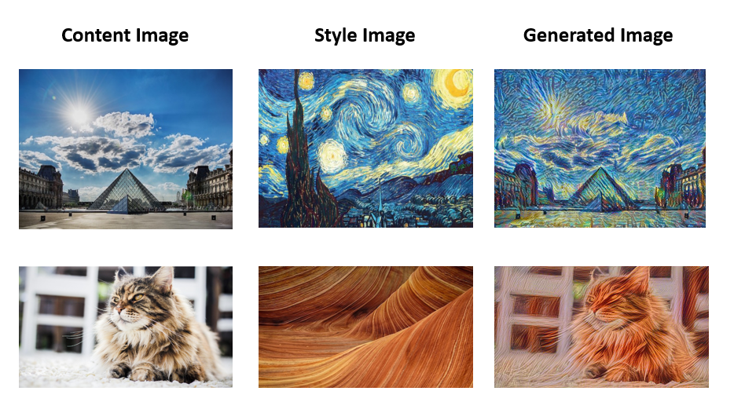

# Neuron-Style-Transfer
Neuron style transfer practice

## What you can do
  - By using the pre-trained model of vgg19, we can extract the features in the middle layers. Chose one layer to computer the content cost to determine the "position" while getting the style cost of serveral layers to obtain the "style" to get the final generated image.
  

## Before starting

- Please downlaod VGG-19 pre-trained model from "https://www.vlfeat.org/matconvnet/pretrained/"
then put it in the path 'pretrained-model/imagenet-vgg-verydeep-19.mat'
- Prepare content & style image you want to do the style transfer on in '/images' and change the corresponded variable in 'NST.py' for "content_image" and "style_image"
- The output picture size will be the same as content image. The stlye image can be arbitrary size and will be resized in the code.
 
## Files Discription
- NST.py : Main program
- NST_util.py : Some default setting and complementary funcitons
- /images : Directory for content & style image
- /output : Where generated imaged saved.
  
## Theory Review
The code will build the Neural Style Transfer (NST) algorithm in three steps:

1. Build the content cost function 
2. Build the style cost function 
3. Put it together to get 

#### Content Cost Function 

#### Style Cost Function 

## Reference:
1. Karen Simonyan and Andrew Zisserman. Very Deep Convolutional Networks For Large-Scale Image Recognition. 2014.
2. Coursea Deep.ai course by Andrew Ng.
